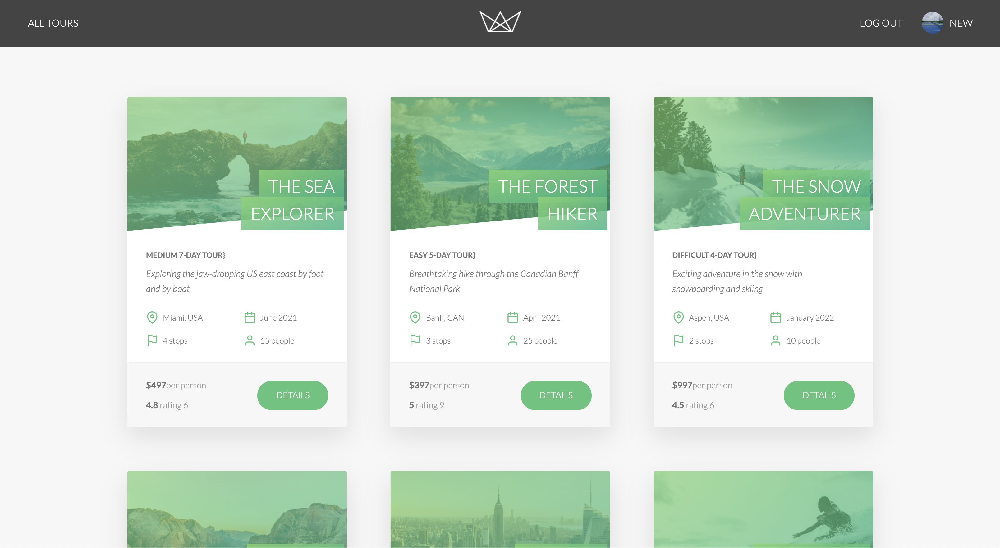
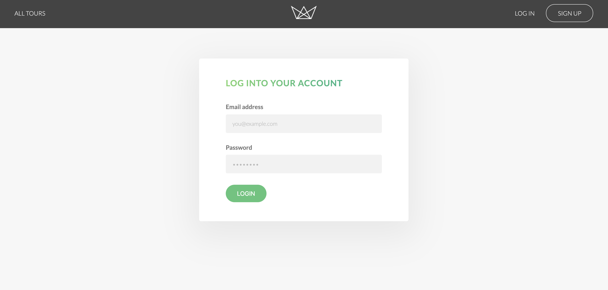
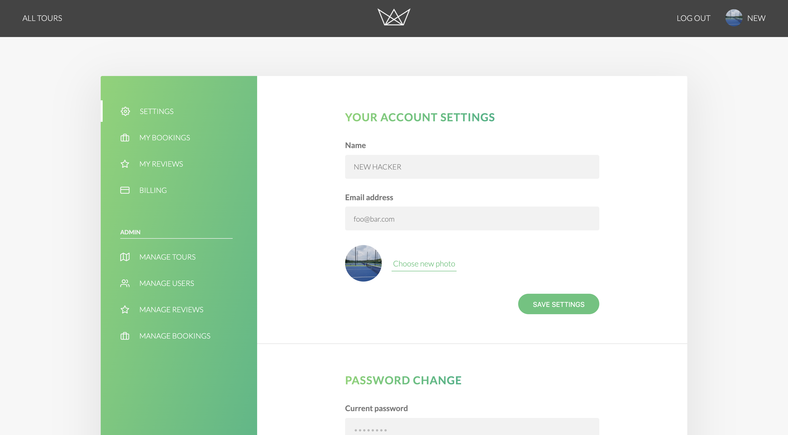

# Tour application

#### [여기서 웹 동작 확인하기](https://patours.herokuapp.com/)

테스트 아이디 / 비밀번호: foo@bar.com / pass1234

## 구현된 화면






## 스킬

- node.js
- express
- pug
- javascript
- jwt
- parcel

## 구현된 기능

- 로그인 / 로그아웃 👮‍♀️
- 비밀번호 변경 🗝
- 프로필 정보 변경 (이름, 이메일, 사진) 📜
- 여행 상품 전체 조회 🇰🇷
- 선택 상품 조회 🚗
- 예약 및 결제 💰

## 추 후 구현할 기능

- 회원가입
- 상품, 사용자, 예약 관리
- 결제내역
- 내 리뷰 보기

## 개발환경 세팅

1. .env 값 설정

```js
NODE_ENV= // 개발 환경 | development || production
DATABASE= // mongo url
DATABASE_PASSWORD= // mongo password
JWT_SECRET= // jwt secret
JWT_EXPIRES_IN= // jwt expire
JWT_COOKIE_EXPIRES_IN= // cookie expire
STRIPE_SECRET_KEY= // stripe key
```

2. 테스트 데이터 입력

```bash
$ npm run mock:import
```

3. 패키지 설치 및 실행

```bash
$ npm i
$ npm run dev
```

## 배포

```bash
$ heroku login
$ heroku create
$ heroku config:set NODE_ENV=
$ heroku config:set DATABASE=
$ heroku config:set DATABASE_PASSWORD=
$ heroku config:set JWT_SECRET=
$ heroku config:set JWT_EXPIRES_IN=
$ heroku config:set JWT_COOKIE_EXPIRES_IN=
$ heroku config:set STRIPE_SECRET_KEY=

$ git add *
$ git push heroku master
$ heroku open
$ heroku apps:rename patours
```
